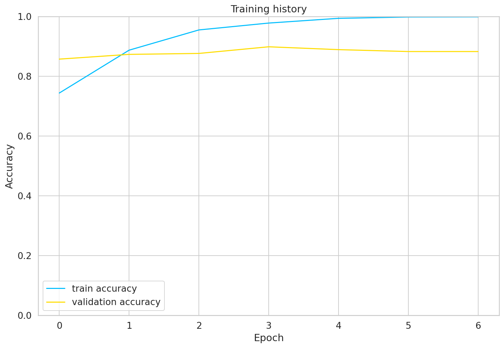
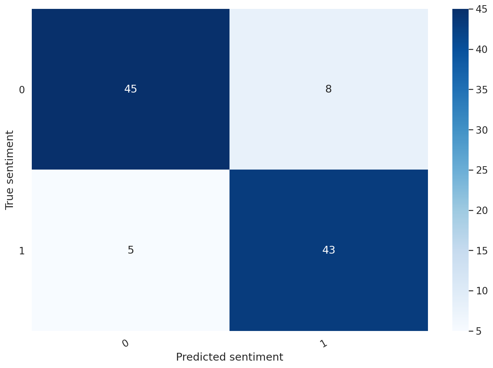

# Applied Deep Learning for NLP - Winter 2020/21

This repository consists of the codebase for *Prediction of Trump vs. Biden support with Sentiment Classification Model trained on YouTube Comments* project. 

Project is seperated into three parts:
1. [Model Creation](#model-creation) explains the model creation process which includes data preparation and model training
2. [Alexa skill](#alexa-skill) that takes the input from the user and uses fastAPI to predict if a given view is more likely to be of a Trump fan or a Biden fan.
3. [API](#api) that includes fastAPI interface for serving the model

### Model Creation

#### Dataset Preparation

[Youtube Data API](https://developers.google.com/youtube/v3/docs) is used to extract comments of a particular YouTube video. Comments of 4 videos were used to create a dataset. These videos are listed below:
1. [Trump speaks at 'Make America Great Again' rally in Florida](https://www.youtube.com/watch?v=PWTb4r7h9ew)
2. [Trump delivers remarks in Pennsylvania](https://www.youtube.com/watch?v=xWrtgnCTmj4)
3. [Joe Biden addresses the nation after election victory](https://www.youtube.com/watch?v=eolEz_jU-vs)
4. [Watch President Joe Biden's full inauguration speech](https://www.youtube.com/watch?v=LGukNIEIhTU)

For each video, highly liked comments are selected and labelled as an indicator of a respective politician's supporter comment. Comments are cleaned out with simple text cleaning operations such as removing emojis, removing special characters and selecting only English comments. 

Overall cleaned dataset consists of over 3000 samples of comments with almost balanced sentiment classes.(0 denotes a Trump supporter comment, 1 denotes a Biden supporter comment)

#### Model Training
Training is carried out in a Google Colaboratory environment with the purpose of using the GPU instance. A pre-trained BERT Sentiment Classifier model is used from Hugging Face's transformers library. Model is fine-tuned with an additional fully-connected layer being connected to the output of the original BERT model. In the latest training, 0.84 accuracy was achieved in the test set.

1. Plot of the latest training 

2. Confusion matrix

### Alexa Skill

This alexa skill uses a custom end-point rather than using the default lambda function provided in an Alexa-hosted-skill template. Hence, it is developped locally rather than using the Alexa skill console. With the help of [local_debugger.py](skill/local_debugger.py) file, it is possible to debug the alexa code and improve the development experience. 

When a custom endpoint is used, Alexa requires that endpoint having an https protocol. Luckily, `ngrok` is able to serve the localhost with https. 

[en-US.json](skill/skill-package/interactionModels/custom/en-US.json) file describes the interaction model such as the intents, slots and the intenhandler names for them. 

The [lambda_function.py](skill/skill/lambda/lambda_function.py) contains all the logic that tells what to do in case of an intent. For instance, it makes requests to the endpoint served via fastAPI via [main.py](api/main.py) file.

### API

BERT inference is fast on CPU and it is not possible to load a BERT model on an EC2 instance that comes with the AWS Free Tier. Therefore, API is served locally via `/checkpoliticalview/{view}` endpoint on the port 5000. Since the skill also runs locally, it is trivial to send request using `http://0.0.0.0:5000` from the skill itself. The `view` parameter is taken from the request and fed into the pretrained BERT model to retrieve a prediction e.g. Biden.

The model class is stored in [SentimentClassifier.py](api/SentimentClassifier.py) which is basic BERT model with having a linear layer on top. The training is carried out in the [notebook file](/notebook/model%20training/sentiment_analysis_trump_biden.ipynb).
